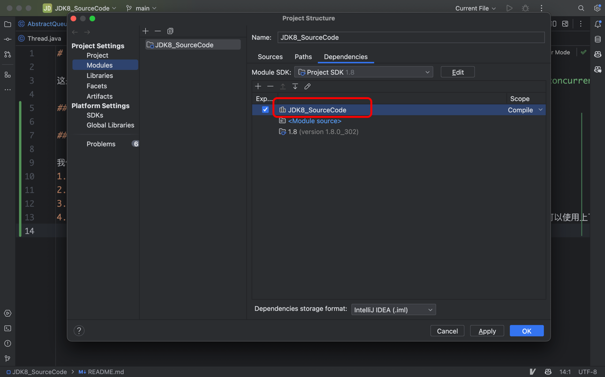

# JDK8_SourceCode_Annotated

这是从JDK 8的 `src.zip` 中提取的源码，目的是为了学习和添加注释，同时使用Git进行版本管理。主要关注 `java.util.concurrent` 包及其他核心类。

## 遇到的问题

### 如何让IDEA自动使用本项目提供的类定义，而不是跳转到JDK的class文件？
要确保IntelliJ IDEA在查找类定义时优先使用项目中提供的类定义，而不是跳转到JDK的class文件，你可以按照以下步骤调整项目结构和库的优先级：
1. 打开File > Project Structure（或使用快捷键Ctrl+Alt+Shift+S）。
2. 在Project Structure窗口中，选择Modules。
3. 在你的模块设置中，找到Dependencies标签页。
4. 如果你的项目依赖于特定的库（这里指的是你自己的项目库，而不是JDK），确保你的项目或模块在列表中的位置高于JDK。你可以使用上下箭头调整它们的顺序。
调整后应该如下图所示，其中红框内就是新添加的dependency，而且在JDK之前。
